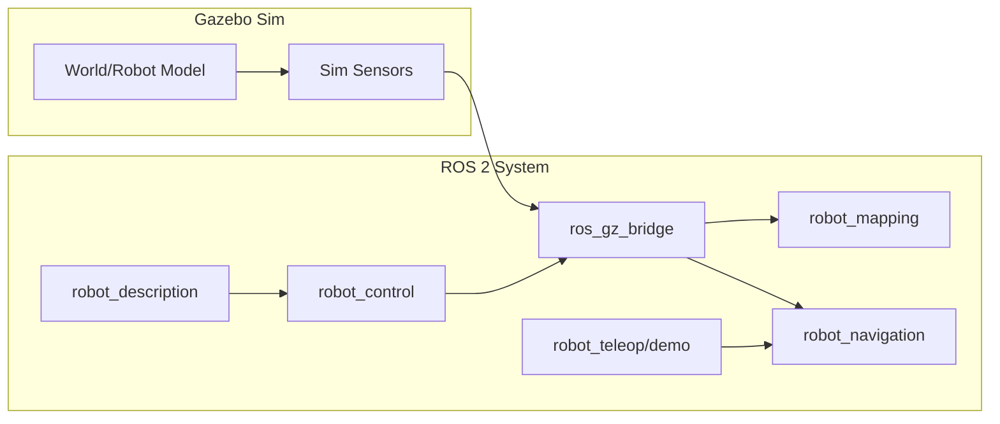
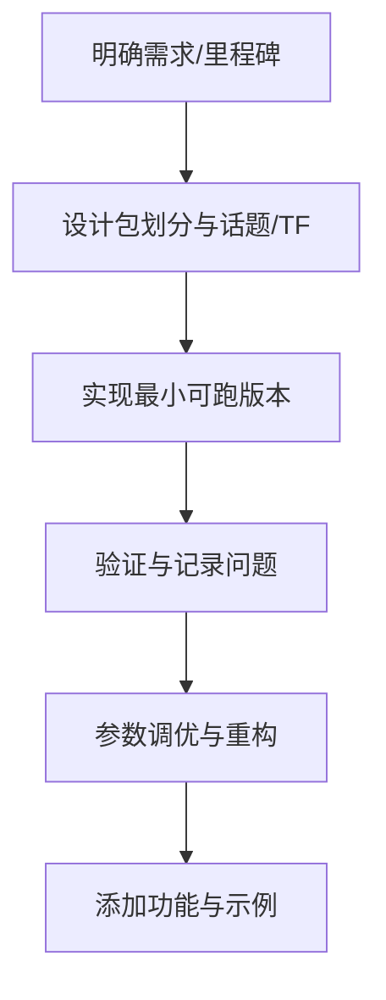

# Ros2Learning

A ROS 2 simulation project for an autonomous vacuum robot.

## Quickstart

> 前提：已安装对应 ROS 2（如 `/opt/ros/jazzy` 存在）。

```bash
cd Ros2Learning/ros2_ws
./scripts/setup_ubuntu.sh jazzy   # 可选
./scripts/build.sh jazzy
source ./scripts/source.sh jazzy
```

## 仿真优先的总体设计（Gazebo + Jazzy）

> 说明：当前阶段以仿真为主，硬件暂不接入。方案成熟后再进入实现阶段。
> 目标读者：未接触过 ROS 的新手，但已了解话题、服务等基础概念。

### 架构示意（方向性）


### 总体架构（分层）
- 硬件抽象层：底盘与传感器接口（仿真中由 Gazebo 提供）。
- 感知层：里程计融合、障碍物感知、代价地图。
- 定位与建图：`slam_toolbox`（学习阶段优先）。
- 导航与决策：`nav2` 行为树与路径规划。
- 应用层：遥控、巡航、定点导航等学习示例。

### 包划分（多包，colcon 管理）
- `robot_description`：URDF/Xacro、TF 树、传感器定义。
- `robot_gz`：Gazebo 世界与模型资源、仿真启动、桥接配置。
- `robot_control`：`ros2_control` 与 diff drive 控制。
- `robot_bringup`：一键启动（仿真 + 机器人 + RViz）。
- `robot_mapping`：`slam_toolbox` 参数与 launch。
- `robot_navigation`：`nav2` 参数与行为树。
- `robot_teleop`：键盘/手柄遥控。

### 关键话题与 TF（约定）
- 话题：`cmd_vel`、`odom`、`scan`、`imu`、`map`、`tf`
- TF：`map -> odom -> base_link -> base_laser/base_imu/base_camera`

### 仿真验证的最小里程碑
1) Gazebo 中小车模型可加载
2) `cmd_vel` 控制底盘运动
3) `scan`/`imu`/`odom` 数据正常发布
4) RViz 中可视化 TF 与传感器数据

### 下一步优化方向（方案先行）
- 明确 Gazebo Sim（Harmonic）与 `ros_gz` 的桥接话题映射
- 统一参数目录与命名规范（`config/*.yaml`）
- 设计可复用的 launch 分层（仿真/建图/导航）

## 方案里程碑（细化）与验收标准

> 时间为单人估算（学习型项目，按自然日计）。

### 基本概念定义（严谨版）
- Gazebo Sim：机器人仿真器，用物理引擎模拟机器人在虚拟世界中的运动与传感器输出。
- ROS 2：机器人软件框架，提供节点、话题、服务、参数与工具链。
- 工作空间（workspace）：一个包含多个 ROS 2 包的目录，使用 `colcon` 统一构建与运行。
- 包（package）：ROS 2 的最小功能单元，包含源码、配置与依赖声明。
- 节点（node）：运行中的程序实例，负责具体功能（如控制、建图、导航）。
- 话题（topic）：节点之间的异步消息通道；发布者发送消息，订阅者接收消息。
- 服务（service）：同步请求-响应的通信方式，用于一次性操作（如清图、重置）。
- TF（坐标变换）：描述各坐标系之间空间关系的系统，用于位置与姿态转换。
- `map`：全局地图坐标系，通常固定不动。
- `odom`：里程计坐标系，连续但可能随时间漂移。
- `base_link`：机器人本体坐标系，表示机器人自身位置与姿态。
- 里程计（odometry）：由轮速/IMU 等估计机器人短期运动的结果。
- `cmd_vel`：速度指令话题，通常包含线速度与角速度。
- `nav2`：ROS 2 的导航框架，包含定位、路径规划、避障与行为树控制。
- `slam_toolbox`：SLAM 工具，用于同时定位与建图。

### M0：环境与基础概念熟悉（1-2 天）
- 工作内容：安装 ROS 2 Jazzy 与 Gazebo Sim（Harmonic）；理解“工作空间=项目目录”“包=功能模块”“节点=运行中的程序”“话题=消息通道”；能运行官方示例。
- 验收标准：`ros2` 与 `gz` 命令可用；`ros2 run demo_nodes_cpp talker` 与 `listener` 可互通；`ros2 topic list` 能看到示例话题。

### M1：机器人描述与仿真模型（2-3 天）
- 工作内容：完成小车 URDF/Xacro（机器人“结构说明书”）；理解 TF（坐标系）与 `robot_state_publisher`（发布各坐标系关系）。
- 验收标准：Gazebo 中可加载模型；`tf` 中存在 `base_link` 与 `base_laser` 等传感器帧；RViz 可显示机器人模型。

### M2：底盘控制与话题闭环（2-3 天）
- 工作内容：接入 `ros2_control` diff drive（差速底盘控制）；理解 `cmd_vel`（速度指令）与 `odom`（里程计）含义。
- 验收标准：`ros2 topic pub /cmd_vel ...` 可驱动模型移动；`/odom` 持续发布且数值合理；停止发指令后速度归零。

### M3：传感器模拟与桥接（2-3 天）
- 工作内容：配置 Gazebo 传感器插件（雷达/IMU/相机）；通过 `ros_gz_bridge` 把 Gazebo 话题转为 ROS 话题；理解常见消息类型（如 `sensor_msgs/LaserScan`、`Imu`）。
- 验收标准：`/scan`、`/imu`、`/camera`（如启用）在 ROS 侧稳定发布；RViz 可显示点云/雷达与 IMU 姿态。

### M4：建图与可视化（2-3 天）
- 工作内容：集成 `slam_toolbox`（同步定位与建图）；理解 `map`（全局地图）、`odom`（短期里程计）、`base_link`（机器人本体）的层级关系。
- 验收标准：RViz 中实时生成 `map` 并可保存；TF 树无断链与明显跳变；建图过程稳定无明显漂移。

### M5：导航与示例任务（3-5 天）
- 工作内容：集成 `nav2`（导航框架）；理解代价地图（障碍物区域）、全局/局部规划器；完成定点导航示例。
- 验收标准：给定目标点后小车可规划与到达；路径平滑、无明显抖动或频繁重规划；到达后稳定停止。

### 开发流程（建议）


## 最低测试流程（手工）

> 说明：占位命令需替换为实际 launch 名称。

1) 启动仿真与系统  
   - 示例：`ros2 launch robot_bringup sim.launch.py`  
   - 验收：Gazebo 打开且小车可见；终端无致命报错。

2) 节点存活检查  
   - 命令：`ros2 node list`  
   - 验收：关键节点存在（控制、桥接、状态发布等）。

3) 话题发布检查  
   - 命令：`ros2 topic list`、`ros2 topic info /cmd_vel`、`ros2 topic info /odom`、`ros2 topic info /scan`  
   - 验收：关键话题存在，类型正确，且有发布者。

4) 话题频率与数据检查  
   - 命令：`ros2 topic hz /odom`、`ros2 topic hz /scan`、`ros2 topic echo /odom --once`  
   - 验收：`/odom`、`/scan` 有稳定频率；`/odom` 数据非零且合理。

5) TF 连通性检查  
   - 命令：`ros2 run tf2_ros tf2_echo map base_link` 或 `ros2 run tf2_tools view_frames`  
   - 验收：`map -> odom -> base_link` 连通无报错。

6) 控制闭环验证  
   - 命令：`ros2 topic pub /cmd_vel geometry_msgs/msg/Twist "{linear: {x: 0.2}, angular: {z: 0.0}}" -r 10`  
   - 验收：模型在 Gazebo 中移动，`/odom` 变化连续。
