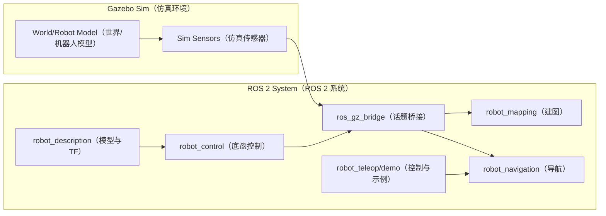
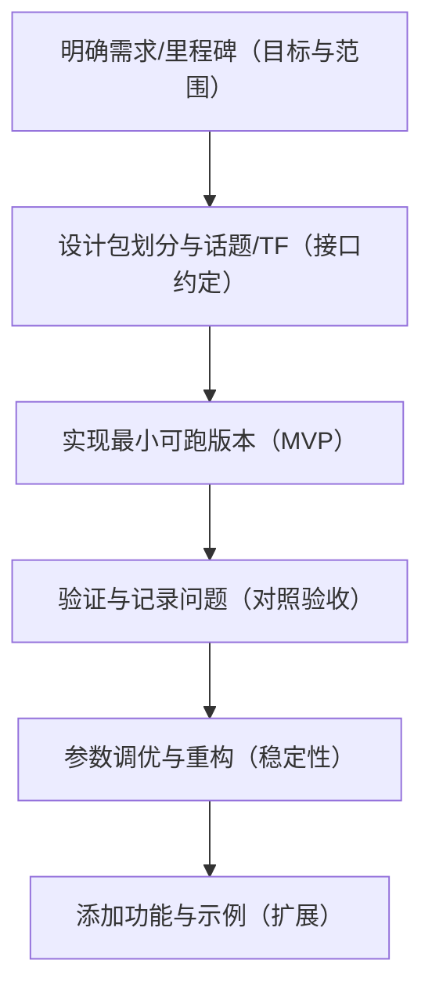

# Ros2Learning

一个用于学习 ROS 2（以 Jazzy 为主）与仿真导航（Gazebo / Nav2 / RViz）的学习型仓库。

本仓库重点：

- 在本地 Linux 上可构建、可运行、可调试
- 用小步迭代方式搭建“仿真优先”的移动机器人栈

## 快速索引

- 只想验证环境/手感：看「新手最快仿真（TurtleBot3 官方示例）」
- 想跑本仓库 ROS 2 包：看「Quickstart（本仓库工作空间）」
- 想 VS Code 单步进入 rclcpp：看「VS Code 调试：步入 rclcpp 源码」

## Quickstart（本仓库工作空间）

前提：已安装对应 ROS 2（例如 `/opt/ros/jazzy` 存在）。

```bash
cd Ros2Learning/ros2_ws

# 可选：安装常用依赖 + rosdep（需要 sudo）
./scripts/setup_ubuntu.sh jazzy

# 构建工作空间（colcon build --symlink-install）
./scripts/build.sh jazzy

# 叠加工作空间环境（后续 ros2 run/launch 需要）
source ./scripts/source.sh jazzy
```

### 最小验证（talker/listener）

终端 A：

```bash
cd Ros2Learning/ros2_ws
source ./scripts/source.sh jazzy
ros2 run ros2_learning_cpp talker
```

终端 B：

```bash
cd Ros2Learning/ros2_ws
source ./scripts/source.sh jazzy
ros2 run ros2_learning_cpp listener
```

## 固定流程示例：多采集点抓取 → 投放点（仿真占位版）

目标：从配置文件读取多个采集点与一个投放点，让机器人依次导航到采集点、执行“抓取”（占位服务），再导航到投放点执行“放置”（占位服务）。  
适用：学习任务编排/导航联动，先跑通流程，后续可替换真实机械臂接口。

### 包与节点说明

- `ros2_learning_task_runner`：任务编排节点 `task_runner`
  - 读取 YAML 配置（采集点/投放点）
  - 依次执行：导航到采集点 → 调用 pick → 导航到投放点 → 调用 place
  - 失败策略：导航失败/抓取失败则跳过当前采集点，继续下一个
- `ros2_learning_manipulation_stub`：抓取/放置占位服务 `manipulation_stub`
  - 提供 `/manipulation/pick` 与 `/manipulation/place`（`std_srvs/Trigger`）
  - 仅模拟延时与日志输出

### 配置文件

默认配置：`ros2_ws/src/ros2_learning_task_runner/config/task_plan.yaml`

```yaml
map_frame: map

dropoff:
  x: 0.0
  y: 0.0
  yaw: 0.0

pickups:
  - x: 1.0
    y: 0.0
    yaw: 0.0
  - x: 1.0
    y: 1.0
    yaw: 1.57
```

### 启动与运行

前提：Nav2 已启动（`navigate_to_pose` action 可用），并已 source 工作空间。

```bash
cd Ros2Learning/ros2_ws
source ./scripts/source.sh jazzy
ros2 launch ros2_learning_task_runner task_runner_sim.launch.py
```

如果想指定自己的配置文件：

```bash
ros2 launch ros2_learning_task_runner task_runner_sim.launch.py \
  task_config:=/absolute/path/to/task_plan.yaml
```

### 话题与接口

- 导航 Action：`navigate_to_pose`（Nav2 默认 Action 名）
- 抓取/放置服务：`/manipulation/pick`、`/manipulation/place`（`std_srvs/Trigger`）
- 剩余距离：`/distance_remaining`（`std_msgs/Float32`，`task_runner` 发布）

## VS Code 调试：步入 rclcpp 源码

本仓库的 VS Code 调试配置已包含 `sourceFileMap`，用于把系统里的 `/usr/src/ros-jazzy-rclcpp-*` 映射到本仓库本地下载的源码目录。

首次在新机器上调试前，先拉取匹配版本的 `rclcpp` 源码（不会提交到 git）：

```bash
./ros2_ws/scripts/setup_rclcpp_source.sh jazzy
```

如果你还希望 **单步进入 libc / 动态链接器（ld.so）**（例如 `_start` / `__libc_start_main` / `libc_start_call_main.h`），再准备两件事：

1) 下载与你系统 glibc 版本匹配的 glibc 源码到本仓库（不会提交到 git）：

```bash
./ros2_ws/scripts/setup_glibc_source.sh
```

2) 拉取 rcutils 源码（可选，但推荐；否则进入 rcutils 时会提示找不到源码）：

```bash
./ros2_ws/scripts/setup_rcutils_source.sh jazzy
```

完成后，使用 VS Code 的调试配置 `ROS2: Debug talker (Stop at entry, step into libc)`，可以更容易从程序入口一路 F11 进入 glibc 启动流程。

补充：如果你希望“停在 talker 自己的入口”而不是先停在 `bash`，可以用调试配置 `ROS2: Debug talker (Direct envFile, stop at entry)`。
它会先执行 Task `ROS2: Export env (jazzy)` 导出一份已 source 的 ROS2 环境到 `.vscode/ros2_jazzy.env`，然后直接启动节点二进制，更适合研究 `_start -> __libc_start_main -> main` 这条链路。

重要：`/opt/ros/${ROS_DISTRO}` 下的很多库（包括 `librclcpp.so`）默认是 **stripped**，没有源码级调试信息。
如果你想真正单步进入 `rclcpp::init` 并看到 `.cpp` 源码，需要安装对应的 dbgsym 包：

```bash
./ros2_ws/scripts/setup_ros2_dbgsym.sh jazzy
```

## 新手最快仿真（TurtleBot3 官方示例）

> 说明：当前仓库尚未内置完整仿真包。想“立刻让小车动起来”，推荐先用官方示例验证环境与手感，再回到本仓库按规划补齐包。

1) 安装 TurtleBot3 仿真与遥控（Ubuntu + Jazzy）

```bash
sudo apt install ros-jazzy-turtlebot3-gazebo ros-jazzy-turtlebot3-teleop
```

2) 启动 Gazebo 仿真（常规）

```bash
export TURTLEBOT3_MODEL=burger
ros2 launch turtlebot3_gazebo turtlebot3_world.launch.py
```

2.1) 如果你的 OpenGL/显卡驱动导致 Gazebo 黑屏或崩溃，可用软件渲染方式启动（保留备用）：

```bash
export LIBGL_ALWAYS_SOFTWARE=1
ros2 launch turtlebot3_gazebo turtlebot3_world.launch.py
```

3) 新终端键盘遥控（WASD）

```bash
source /opt/ros/jazzy/setup.bash
ros2 run ros2_learning_turtlebot3_teleop teleop_keyboard
```

常见卡点：Gazebo 未安装/未启动、`TURTLEBOT3_MODEL` 未设置、ROS 发行版不一致。

## 仿真优先的总体设计（Gazebo + Jazzy）

说明：当前阶段以仿真为主，硬件暂不接入。方案成熟后再进入实现阶段。
目标读者：未接触过 ROS 的新手，但已了解话题、服务等基础概念。

### 架构示意（方向性）



### 总体架构（分层）

- 硬件抽象层：底盘与传感器接口（仿真中由 Gazebo 提供）。
- 感知层：里程计融合、障碍物感知、代价地图。
- 定位与建图：`slam_toolbox`（学习阶段优先）。
- 导航与决策：`nav2` 行为树与路径规划。
- 应用层：遥控、巡航、定点导航等学习示例。

### 包划分（多包，colcon 管理）

- `robot_description`：URDF/Xacro、TF 树、传感器定义。
- `robot_gz`：Gazebo 世界与模型资源、仿真启动、桥接配置。
- `robot_control`：`ros2_control` 与 diff drive 控制。
- `robot_bringup`：一键启动（仿真 + 机器人 + RViz）。
- `robot_mapping`：`slam_toolbox` 参数与 launch。
- `robot_navigation`：`nav2` 参数与行为树。
- `robot_teleop`：键盘/手柄遥控。

### 头文件组织约定（本仓库偏好）

为减少目录层级、提升可读性，本仓库的 ROS 2 包采用“扁平 include”组织方式：

- 头文件直接放在 `include/` 下（例如 `ros2_ws/src/<pkg>/include/foo.hpp`）
- 源文件包含时使用 `#include "foo.hpp"`，而不是 `#include "<pkg>/foo.hpp"`

注意：这种做法在多包/多依赖场景下可能出现“不同包头文件同名”冲突；一旦发生，建议改回 `include/<pkg>/...` 或给头文件加更明确的前缀命名。

### 关键话题与 TF（约定）

- 话题：`cmd_vel`、`odom`、`scan`、`imu`、`map`、`tf`
- TF：`map -> odom -> base_link -> base_laser/base_imu/base_camera`

### 仿真验证的最小里程碑

1) Gazebo 中小车模型可加载
2) `cmd_vel` 控制底盘运动
3) `scan`/`imu`/`odom` 数据正常发布
4) RViz 中可视化 TF 与传感器数据

### 下一步优化方向（方案先行）

- 明确 Gazebo Sim（Harmonic）与 `ros_gz` 的桥接话题映射
- 统一参数目录与命名规范（`config/*.yaml`）
- 设计可复用的 launch 分层（仿真/建图/导航）

## 方案里程碑（细化）与验收标准

> 时间为单人估算（学习型项目，按自然日计）。

### 基本概念定义（严谨版）

- Gazebo Sim：机器人仿真器，用物理引擎模拟机器人在虚拟世界中的运动与传感器输出。
- ROS 2：机器人软件框架，提供节点、话题、服务、参数与工具链。
- 工作空间（workspace）：一个包含多个 ROS 2 包的目录，使用 `colcon` 统一构建与运行。
- 包（package）：ROS 2 的最小功能单元，包含源码、配置与依赖声明。
- 节点（node）：运行中的程序实例，负责具体功能（如控制、建图、导航）。
- 话题（topic）：节点之间的异步消息通道；发布者发送消息，订阅者接收消息。
- 服务（service）：同步请求-响应的通信方式，用于一次性操作（如清图、重置）。
- TF（坐标变换）：描述各坐标系之间空间关系的系统，用于位置与姿态转换。
- `map`：全局地图坐标系，通常固定不动。
- `odom`：里程计坐标系，连续但可能随时间漂移。
- `base_link`：机器人本体坐标系，表示机器人自身位置与姿态。
- 里程计（odometry）：由轮速/IMU 等估计机器人短期运动的结果。
- `cmd_vel`：速度指令话题，通常包含线速度与角速度。
- `nav2`：ROS 2 的导航框架，包含定位、路径规划、避障与行为树控制。
- `slam_toolbox`：SLAM 工具，用于同时定位与建图。

### M0：环境与基础概念熟悉（1-2 天）

- 工作内容：安装 ROS 2 Jazzy 与 Gazebo Sim（Harmonic）；理解“工作空间=项目目录”“包=功能模块”“节点=运行中的程序”“话题=消息通道”；能运行官方示例。
- 验收标准：`ros2` 与 `gz` 命令可用；`ros2 run demo_nodes_cpp talker` 与 `listener` 可互通；`ros2 topic list` 能看到示例话题。

### M1：机器人描述与仿真模型（2-3 天）

- 工作内容：完成小车 URDF/Xacro（机器人“结构说明书”）；理解 TF（坐标系）与 `robot_state_publisher`（发布各坐标系关系）。
- 验收标准：Gazebo 中可加载模型；`tf` 中存在 `base_link` 与 `base_laser` 等传感器帧；RViz 可显示机器人模型。

### M2：底盘控制与话题闭环（2-3 天）

- 工作内容：接入 `ros2_control` diff drive（差速底盘控制）；理解 `cmd_vel`（速度指令）与 `odom`（里程计）含义。
- 验收标准：`ros2 topic pub /cmd_vel ...` 可驱动模型移动；`/odom` 持续发布且数值合理；停止发指令后速度归零。

### M3：传感器模拟与桥接（2-3 天）

- 工作内容：配置 Gazebo 传感器插件（雷达/IMU/相机）；通过 `ros_gz_bridge` 把 Gazebo 话题转为 ROS 话题；理解常见消息类型（如 `sensor_msgs/LaserScan`、`Imu`）。
- 验收标准：`/scan`、`/imu`、`/camera`（如启用）在 ROS 侧稳定发布；RViz 可显示点云/雷达与 IMU 姿态。

### M4：建图与可视化（2-3 天）

- 工作内容：集成 `slam_toolbox`（同步定位与建图）；理解 `map`（全局地图）、`odom`（短期里程计）、`base_link`（机器人本体）的层级关系。
- 验收标准：RViz 中实时生成 `map` 并可保存；TF 树无断链与明显跳变；建图过程稳定无明显漂移。

### M5：导航与示例任务（3-5 天）

- 工作内容：集成 `nav2`（导航框架）；理解代价地图（障碍物区域）、全局/局部规划器；完成定点导航示例。
- 验收标准：给定目标点后小车可规划与到达；路径平滑、无明显抖动或频繁重规划；到达后稳定停止。

### 开发流程（建议）



## 最低测试流程（手工）

> 说明：占位命令需替换为实际 launch 名称。

1) 启动仿真与系统
   - 示例：`ros2 launch robot_bringup sim.launch.py`
   - 验收：Gazebo 打开且小车可见；终端无致命报错。

2) 节点存活检查
   - 命令：`ros2 node list`
   - 验收：关键节点存在（控制、桥接、状态发布等）。

3) 话题发布检查
   - 命令：`ros2 topic list`、`ros2 topic info /cmd_vel`、`ros2 topic info /odom`、`ros2 topic info /scan`
   - 验收：关键话题存在，类型正确，且有发布者。

4) 话题频率与数据检查
   - 命令：`ros2 topic hz /odom`、`ros2 topic hz /scan`、`ros2 topic echo /odom --once`
   - 验收：`/odom`、`/scan` 有稳定频率；`/odom` 数据非零且合理。

5) TF 连通性检查
   - 命令：`ros2 run tf2_ros tf2_echo map base_link` 或 `ros2 run tf2_tools view_frames`
   - 验收：`map -> odom -> base_link` 连通无报错。

6) 控制闭环验证
   - 命令：`ros2 topic pub /cmd_vel geometry_msgs/msg/Twist "{linear: {x: 0.2}, angular: {z: 0.0}}" -r 10`
   - 验收：模型在 Gazebo 中移动，`/odom` 变化连续。
