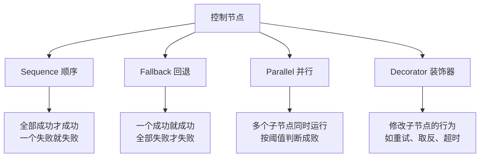
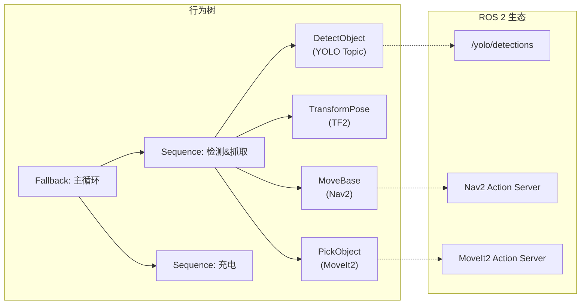

# 🌳 BehaviorTree.CPP 学习路线图

## 你的起点

你目前已有的 BT 代码结构：

| 文件 | 内容 | 涉及的概念 |
|---|---|---|
| [simple_patrol.xml](file:///root/Ros2Learning/ros2_ws/src/ros2_learning_behavior_tree/behavior_trees/simple_patrol.xml) | 一个纯 Sequence 的线性任务 | XML 定义行为树 |
| [bt_main.cpp](file:///root/Ros2Learning/ros2_ws/src/ros2_learning_behavior_tree/src/bt_main.cpp) | Factory 注册 + tick 循环 | BT 引擎的启动流程 |
| [move_base_node](file:///root/Ros2Learning/ros2_ws/src/ros2_learning_behavior_tree/src/nodes/move_base_node.cpp) | Nav2 导航封装 | **StatefulActionNode** (异步) |
| [simple_arm_action](file:///root/Ros2Learning/ros2_ws/src/ros2_learning_behavior_tree/src/nodes/simple_arm_action.cpp) | 模拟机械臂 | **SyncActionNode** (同步) |

> [!NOTE]
> 当前代码只用了 `Sequence`，没有分支、没有条件判断、没有重试。相当于"执行一个固定清单"，还远不是真正的"决策树"。

---

## Phase 1️⃣ — 彻底读懂现有代码（预计 1-2 天）

**目标**：不借助 AI 也能解释每一行代码为什么这样写。

### 学习清单

- [ ] **理解 BT 的三种返回状态**：`SUCCESS` / `FAILURE` / `RUNNING`
  - 画一张表：每种节点类型分别何时返回哪种状态
- [ ] **SyncActionNode vs StatefulActionNode 的本质区别**
  - `tick()` vs `onStart()` + `onRunning()` + `onHalted()`
  - 为什么导航用 Stateful 而手臂用 Sync?
- [ ] **Factory + Builder 注册机制**
  - `registerNodeType` vs `registerBuilder` 的区别
  - 为什么需要 lambda 来注入 ROS 节点?
- [ ] **tick 循环与 `spin_some` 的关系**
  - 如果去掉 `spin_some` 会怎样？（答：回调永远不会触发）
  - tick 频率对行为树性能的影响
- [ ] **Port 系统**
  - `InputPort` / `OutputPort` 是什么
  - XML 中的属性值如何传给 C++ 的 `getInput`

### 动手练习

1. **注释挑战**：不参考任何 AI，给 `move_base_node.cpp` 的每一行写注释
2. **实验**：把 `simple_patrol.xml` 中某个 `MoveBase` 的坐标改成不可达的值，观察行为树的行为（是停在失败点还是继续？）

---

## Phase 2️⃣ — 控制流核心概念（预计 3-5 天）

**目标**：掌握行为树的"四大金刚"控制节点。

### 核心概念



### 学习顺序

| 步骤 | 概念 | 练习 |
|---|---|---|
| 1 | **Fallback (回退)** | 写一个 XML：先尝试去 A 点，失败则去 B 点 |
| 2 | **Condition 节点** | 写一个 `IsLocationReached` 条件节点（返回 SUCCESS/FAILURE） |
| 3 | **Fallback + Condition 组合** | "如果已到达 → 跳过 / 否则 → 导航过去" |
| 4 | **Decorator: Repeat** | 让巡逻无限循环 (`<Repeat num_cycles="-1">`) |
| 5 | **Decorator: RetryUntilSuccessful** | 导航失败自动重试 3 次 |
| 6 | **Decorator: Timeout** | 导航超过 30 秒自动取消 |
| 7 | **Parallel** | 同时导航 + 播放语音提示 |

### 推荐的 XML 练习（逐步递进）

**练习 2-1**：失败回退
```xml
<Fallback>
    <MoveBase goal_x="99" goal_y="99" goal_yaw="0"/>  <!-- 故意不可达 -->
    <MoveBase goal_x="1.0" goal_y="0.0" goal_yaw="0"/>  <!-- 备选点 -->
</Fallback>
```

**练习 2-2**：循环巡逻
```xml
<Repeat num_cycles="-1">
    <Sequence>
        <MoveBase goal_x="1.0" goal_y="0.0" goal_yaw="0"/>
        <MoveBase goal_x="0.0" goal_y="1.0" goal_yaw="1.57"/>
        <MoveBase goal_x="0.0" goal_y="0.0" goal_yaw="3.14"/>
    </Sequence>
</Repeat>
```

**练习 2-3**：带重试和超时的健壮巡逻
```xml
<Repeat num_cycles="-1">
    <Sequence>
        <Timeout msec="30000">
            <RetryUntilSuccessful num_attempts="3">
                <MoveBase goal_x="1.0" goal_y="0.0" goal_yaw="0"/>
            </RetryUntilSuccessful>
        </Timeout>
        <SimpleArmAction target_joint_angle="1.57"/>
    </Sequence>
</Repeat>
```

---

## Phase 3️⃣ — Blackboard 与数据流（预计 3-5 天）

**目标**：让节点之间能传递数据，而不是把值写死在 XML 里。

### 核心概念

> [!IMPORTANT]
> **Blackboard = 行为树的"共享白板"**。一个节点把数据写到白板上，另一个节点可以读取。这是行为树实现动态行为的关键。

### 学习清单

- [ ] **InputPort / OutputPort**
  - `OutputPort`：节点"写"数据到 Blackboard
  - `InputPort`：节点从 Blackboard "读"数据
  - XML 中用 `{变量名}` 语法引用 Blackboard 值
- [ ] **动态目标点**
  - 写一个 `PickTargetFromList` 节点，从预设列表中取出下一个目标点写入 Blackboard
  - `MoveBase` 从 Blackboard 读取目标，而非 XML 硬编码
- [ ] **条件判断 + 数据驱动**
  - 写一个 `CheckBattery` 条件节点（模拟电量检测）
  - 电量低 → 导航到充电站 / 电量充足 → 继续巡逻

### 预期的 XML 结构

```xml
<Sequence>
    <!-- 节点将目标写入 Blackboard 的 {target_x}, {target_y} -->
    <PickTargetFromList  target_x="{target_x}"  target_y="{target_y}"/>
    
    <!-- MoveBase 从 Blackboard 读取 -->
    <MoveBase  goal_x="{target_x}"  goal_y="{target_y}"  goal_yaw="0"/>
</Sequence>
```

### 需要写的新 C++ 节点

| 节点名 | 类型 | 端口 | 功能 |
|---|---|---|---|
| `PickTargetFromList` | SyncActionNode | `OutputPort: target_x, target_y` | 从列表中循环取点 |
| `CheckBattery` | ConditionNode | `InputPort: min_level` | 模拟电量 > 阈值返回 SUCCESS |
| `LogMessage` | SyncActionNode | `InputPort: message` | 打印日志（调试用） |

---

## Phase 4️⃣ — SubTree 与大型树管理（预计 2-3 天）

**目标**：学会拆分和复用行为树。

### 学习清单

- [ ] **SubTree**：将复杂行为拆分为独立的子树文件
- [ ] **SubTree 端口映射**：父树和子树之间如何传递数据
- [ ] **多树文件管理**：一个 XML 定义多棵树，互相引用

### 预期结构

```
behavior_trees/
├── main_tree.xml          # 主控逻辑
├── patrol_subtree.xml     # 巡逻子树
├── pick_subtree.xml       # 抓取子树
└── charge_subtree.xml     # 充电子树
```

---

## Phase 5️⃣ — 整合到感知-决策-执行闭环（方向二）

**目标**：将 YOLO、Nav2、MoveIt2 通过行为树串联为一个完整系统。

### 预期架构



### 需要新增的 BT 节点

| 节点 | 功能 | 依赖 |
|---|---|---|
| `DetectObject` | 订阅 YOLO 话题，检测到目标返回 SUCCESS | `ros2_learning_yolo_detector` |
| `TransformPose` | 用 TF2 将相机坐标转为 map 坐标 | `ros2_learning_tf_quaternion_demo` |
| `PickObject` | 调用 MoveIt2 抓取 | `ros2_learning_arm_basics` |
| `CheckBattery` | 电量条件判断 | 模拟 |

---

## 📚 推荐资源

| 资源 | 说明 |
|---|---|
| [BehaviorTree.CPP 官方教程](https://www.behaviortree.dev/) | **最权威**，按顺序读 Tutorial 1-10 |
| [Nav2 BT 文档](https://docs.nav2.org/behavior_trees/index.html) | Nav2 如何使用行为树，可以学习它的 XML 结构 |
| [Groot2](https://www.behaviortree.dev/groot) | 行为树可视化编辑器，强烈推荐 |

---

## ⏱️ 总时间预估

| Phase | 预计时间 | 产出 |
|---|---|---|
| Phase 1 - 读懂现有代码 | 1-2 天 | 能不依赖 AI 解释每行代码 |
| Phase 2 - 控制流 | 3-5 天 | 多个练习 XML + 运行验证 |
| Phase 3 - Blackboard | 3-5 天 | 3 个新 C++ 节点 + 动态巡逻树 |
| Phase 4 - SubTree | 2-3 天 | 多文件行为树组织 |
| Phase 5 - 闭环集成 | 5-7 天 | 完整的感知-决策-执行系统 |
| **总计** | **约 2-4 周** | |
