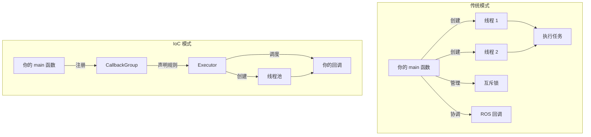

# 🧵 ROS 2 Multithreading & Executor Demo

## 📋 概述

这个包演示了 ROS 2 **执行器（Executor）** 和 **回调组（CallbackGroup）** 的核心概念，通过对比单线程和多线程执行器处理阻塞任务的不同表现，帮助理解 ROS 2 的并发机制。

## 🎯 核心知识点

### 1️⃣ Executor（执行器）

| Executor 类型 | 线程数 | 并发能力 | 适用场景 |
|---|---|---|---|
| **SingleThreadedExecutor** | 1 | ❌ 无并发 | 简单节点、调试 |
| **MultiThreadedExecutor** | 多个 | ✅ 支持并发 | 复杂系统、实时性要求高 |

### 2️⃣ CallbackGroup（回调组）

| 类型 | 同组回调的并发性 | 核心规则 | 适用场景 |
|---|---|---|---|
| **MutuallyExclusive**<br/>（互斥组） | ❌ 绝对串行 | 组内任何回调运行，其他都得等 | 访问共享变量、默认行为 |
| **Reentrant**<br/>（可重入组） | ✅ 全力并发 | 只要有空闲线程，组内外回调随意跑 | 耗时任务、解决死锁 |

> [!IMPORTANT]
> **可重入 (Reentrant) 的含义**：甚至允许**同一个回调函数**被多个线程同时进入执行（例如定时器触发频率高于执行速度时）。详细解析见 [doc/REENTRANT_EXPLAINED.md](./doc/REENTRANT_EXPLAINED.md) 镜像文档。

> [!IMPORTANT]
> **关键规则**：即使使用 `MultiThreadedExecutor`，**同一个 MutuallyExclusive 组内的回调仍然会串行执行**。要实现真正的并发，必须将回调分配到**不同的互斥组**或**可重入组**。

---

## 🏗️ 包结构

```
ros2_learning_multithreading/
├── doc/                           # 📚 详细学习文档
│   ├── REENTRANT_EXPLAINED.md      # 可重入性深度解析
│   └── ros2_execution_architecture.md # 执行架构 (Executor/Group/Callback)
├── include/ros2_learning_multithreading/
│   └── blocking_node.hpp          # 演示节点头文件
├── src/
│   ├── blocking_node.cpp          # 节点实现（两个定时器演示）
│   └── executor_demo_main.cpp     # 主程序（支持切换执行器类型）
├── CMakeLists.txt
├── package.xml
└── README.md
```

---

## 🧪 演示场景

### 节点组成

`BlockingNode` 包含两个定时器：

| 定时器 | 周期 | 功能 | 回调组 | 模拟场景 |
|---|---|---|---|---|
| **心跳定时器** | 500ms | 快速打印心跳 | `callback_group_1_` | 底盘控制指令 |
| **繁重计算定时器** | 3s | **阻塞 2 秒** | `callback_group_2_` | 全局路径规划 |

---

## 🚀 使用方法

### 编译
```bash
cd ~/Ros2Learning/ros2_ws
colcon build --packages-select ros2_learning_multithreading
source install/setup.bash
```

### 运行对比实验

#### 实验 A：单线程执行器（观察阻塞现象）
```bash
ros2 run ros2_learning_multithreading executor_demo
```

**预期现象**：
```
[INFO] Executor Type: single
[INFO] Using SingleThreadedExecutor (Blocking!)
[INFO] [心跳] 咚! 线程 ID: 140123456789
[WARN] [计算] 开始复杂计算... 线程 ID: 140123456789 (预计阻塞 2秒)
# ⚠️ 心跳暂停 2 秒！（被计算阻塞）
[WARN] [计算] 计算完成！
[INFO] [心跳] 咚! 线程 ID: 140123456789
```

**分析**：
- ❌ 繁重计算阻塞了心跳定时器
- ❌ 所有回调运行在**同一线程**
- ❌ 不适合有实时性要求的系统

---

#### 实验 B：多线程执行器（心跳不受影响）
```bash
ros2 run ros2_learning_multithreading executor_demo --ros-args -p executor_type:=multi
```

**预期现象**：
```
[INFO] Executor Type: multi
[INFO] Using MultiThreadedExecutor (Parallel!)
[INFO] [心跳] 咚! 线程 ID: 140123456001
[WARN] [计算] 开始复杂计算... 线程 ID: 140123456002 (预计阻塞 2秒)
[INFO] [心跳] 咚! 线程 ID: 140123456001  # ✅ 心跳继续跳动！
[INFO] [心跳] 咚! 线程 ID: 140123456001  # ✅ 心跳继续跳动！
[WARN] [计算] 计算完成！
```

**分析**：
- ✅ 心跳和计算运行在**不同线程**
- ✅ 心跳不受计算阻塞的影响
- ✅ 适合复杂、实时性要求高的系统

---

## 📊 代码核心讲解

### 回调组的创建与分配

```cpp
// blocking_node.cpp

// 创建两个独立的互斥组
callback_group_1_ = this->create_callback_group(rclcpp::CallbackGroupType::MutuallyExclusive);
callback_group_2_ = this->create_callback_group(rclcpp::CallbackGroupType::MutuallyExclusive);

// 心跳定时器 → 分配到组 1
heartbeat_timer_ = this->create_wall_timer(
    500ms,
    std::bind(&BlockingNode::on_heartbeat, this),
    callback_group_1_);  // ← 指定回调组

// 繁重计算定时器 → 分配到组 2
heavy_timer_ = this->create_wall_timer(
    3000ms,
    std::bind(&BlockingNode::on_heavy_calculation, this),
    callback_group_2_);  // ← 指定回调组
```

> [!TIP]
> **关键点**：由于两个定时器在**不同的互斥组**，`MultiThreadedExecutor` 可以并行执行它们。

---

### 主程序中的执行器切换

```cpp
// executor_demo_main.cpp

// 通过 ROS 参数控制执行器类型
node->declare_parameter("executor_type", "single");
std::string executor_type = node->get_parameter("executor_type").as_string();

if (executor_type == "multi")
{
    // 多线程执行器
    rclcpp::executors::MultiThreadedExecutor executor;
    executor.add_node(node);
    executor.spin();
}
else
{
    // 单线程执行器（默认）
    rclcpp::spin(node);  // 等同于 SingleThreadedExecutor
}
```

---

## 🎓 实战应用场景

### 机器人系统中的典型应用

| 任务类型 | 实时性要求 | 推荐回调组 | 原因 |
|---|---|---|---|
| 电机控制指令发送 | 高 | 独立的 MutuallyExclusive | 避免被阻塞 |
| 传感器数据发布 | 高 | 独立的 MutuallyExclusive | 保证发布频率 |
| 全局路径规划 | 低 | 独立的 MutuallyExclusive 或 Reentrant | 可以阻塞较长时间 |
| 图像处理 | 低 | 独立的 MutuallyExclusive 或 Reentrant | 耗时较长 |
| 数据库写入 | 低 | 独立的 MutuallyExclusive | 避免阻塞主控流程 |

### 推荐架构

```cpp
// 高优先级任务（实时性关键）
auto realtime_group = create_callback_group(CallbackGroupType::MutuallyExclusive);
motor_cmd_timer_ = create_wall_timer(10ms, ..., realtime_group);

// 低优先级任务（可以阻塞）
auto background_group = create_callback_group(CallbackGroupType::Reentrant);
planning_timer_ = create_wall_timer(1s, ..., background_group);
vision_timer_ = create_wall_timer(500ms, ..., background_group);
```

搭配 `MultiThreadedExecutor` 使用，确保实时任务不受后台任务影响。

---

## 🔍 常见问题

### Q1：为什么用了 `MultiThreadedExecutor` 还是被阻塞？

**A**：检查回调组配置！如果所有回调都在**同一个 MutuallyExclusive 组**（或默认组），即使是多线程执行器也只能串行执行。

**解决方法**：
```cpp
// ❌ 错误：都在默认组
timer1_ = create_wall_timer(100ms, callback1);  // 默认组
timer2_ = create_wall_timer(1s, callback2);     // 默认组

// ✅ 正确：分配到不同组
auto group1 = create_callback_group(CallbackGroupType::MutuallyExclusive);
auto group2 = create_callback_group(CallbackGroupType::MutuallyExclusive);
timer1_ = create_wall_timer(100ms, callback1, group1);
timer2_ = create_wall_timer(1s, callback2, group2);
```

---

### Q2：什么时候用 Reentrant 组？

**A**：当回调之间**完全独立**、没有共享状态时，可以用 Reentrant 组提高并发度。

**示例**：
```cpp
auto parallel_group = create_callback_group(CallbackGroupType::Reentrant);

// 这三个任务完全独立，可以并行运行
vision_sub_ = create_subscription(..., parallel_group);
lidar_sub_ = create_subscription(..., parallel_group);
imu_sub_ = create_subscription(..., parallel_group);
```

---

### Q3：单线程执行器有什么用？

**A**：
- ✅ 调试更简单（不用担心竞态条件）
- ✅ 内存占用更小
- ✅ 适合简单、无实时性要求的节点

---

## 📚 相关学习资源

- [ROS 2 官方文档 - Executors](https://docs.ros.org/en/rolling/Concepts/About-Executors.html)
- [ROS 2 Callback Groups 教程](https://docs.ros.org/en/rolling/How-To-Guides/Using-callback-groups.html)
- [本项目详细解析 - 执行架构](./doc/ros2_execution_architecture.md)
- [本项目详细解析 - 可重入性](./doc/REENTRANT_EXPLAINED.md)
- 本项目的学习路线图：[`../ros2_learning_behavior_tree/docs/bt_learning_roadmap.md`](../ros2_learning_behavior_tree/docs/bt_learning_roadmap.md)

---

## 💡 总结

| 概念 | 核心要点 |
|---|---|
| **Executor** | 控制节点的运行方式（单线程 vs 多线程） |
| **CallbackGroup** | 控制回调之间的并发规则（互斥 vs 可重入） |
| **关键组合** | `MultiThreadedExecutor` + 多个独立的回调组 = 真正的并发 |

掌握这些概念后，你可以：
- 为机器人系统设计高效的并发架构
- 避免实时任务被阻塞
- 充分利用多核 CPU 的性能

---

## 🏛️ 设计模式深度分析：控制反转（IoC）

> [!NOTE]
> **这一节从软件工程的角度深入分析 ROS 2 Executor 的设计哲学。理解这些设计原则，不仅能帮你更好地使用 ROS 2，还能提升整体的软件架构能力。**

### 什么是控制反转（Inversion of Control）？

**传统控制流**：你的代码**主动调用**框架或库的功能。
```cpp
// 传统模式：你控制一切
MyThread thread;
thread.start();      // 你主动启动
thread.doWork();     // 你主动调用
thread.stop();       // 你主动停止
```

**控制反转**：框架**调用**你的代码，你只需要**注册**自己的行为。
```cpp
// IoC 模式：框架控制执行流
Framework framework;
framework.registerCallback(myCallback);  // 你只注册
framework.run();                         // 框架决定何时调用你的代码
```

---

### ROS 2 Executor 中的 IoC 体现

#### 控制流对比



**关键区别**：
- **传统**：你 → 创建线程 → 调用函数
- **IoC**：你 → 注册回调 → 框架调用你

---

### 为什么 ROS 2 选择 IoC？

#### 1️⃣ **简化用户代码（降低认知负担）**

**传统多线程编程的复杂度**：
```cpp
// 你需要管理的东西：
✓ 线程创建/销毁
✓ 互斥锁（mutex）
✓ 条件变量（condition variable）
✓ 死锁检测
✓ 资源竞争
✓ 线程安全的数据结构
✓ 线程生命周期管理
```

**IoC 后的简化**：
```cpp
// 你只需要：
✓ 声明回调组类型
✓ 写回调函数
```

**代码量对比**：
| 模型 | 线程管理代码 | 业务逻辑代码 | 总行数 |
|---|---|---|---|
| 传统 | ~50 行 | ~20 行 | ~70 行 |
| IoC | ~3 行 | ~20 行 | ~23 行 |

---

#### 2️⃣ **统一调度策略**

**传统模式的问题**：
```cpp
// 每个开发者自己管理线程
NodeA::NodeA() {
    thread1_ = std::thread(...);  // 优先级？
    thread2_ = std::thread(...);  // CPU 亲和性？
}

NodeB::NodeB() {
    worker_ = std::thread(...);   // 和 NodeA 冲突了？
}
```
结果：系统级的资源竞争，难以调优。

**IoC 模式的优势**：
```cpp
// 所有节点的回调统一由 Executor 管理
MultiThreadedExecutor executor(num_threads, priority_settings);
executor.add_node(node_a);  // 统一调度
executor.add_node(node_b);  // 统一调度
executor.spin();
```
结果：全局最优的调度策略。

---

#### 3️⃣ **可测试性**

**传统模式**：
```cpp
// 难以测试
class MyNode {
    std::thread worker_;  // 测试时很难 mock 线程行为
};

// 测试代码
TEST(MyNode, WorkerBehavior) {
    MyNode node;
    // ❌ 如何验证 worker_ 的行为？需要真实的线程
}
```

**IoC 模式**：
```cpp
// 容易测试
class MyNode {
    void on_timer() { /* 纯函数 */ }
};

// 测试代码
TEST(MyNode, TimerCallback) {
    MyNode node;
    node.on_timer();  // ✅ 直接调用，不需要线程
}
```

---

#### 4️⃣ **扩展性**

**传统模式**：如果要改变并发策略（如加优先级调度），需要修改每个节点。

**IoC 模式**：只需替换 Executor。
```cpp
// 原来
MultiThreadedExecutor executor;

// 改为优先级调度（假设有这样的 Executor）
PriorityExecutor executor(priority_config);
// 节点代码完全不变！
```

---

### 设计模式分类

ROS 2 Executor 实际上组合了多种设计模式：

#### 1️⃣ **Hollywood 原则（"Don't call us, we'll call you"）**
```cpp
// 你不调用框架，框架调用你
class MyNode {
    void callback() {  // 框架会调这个函数
        // 你的逻辑
    }
};
```

#### 2️⃣ **策略模式（Strategy Pattern）**
```cpp
// 不同的回调组 = 不同的并发策略
MutuallyExclusive → 策略：串行执行
Reentrant         → 策略：并行执行
```

#### 3️⃣ **线程池模式（Thread Pool Pattern）**
```cpp
// Executor 内部维护线程池
class MultiThreadedExecutor {
    std::vector<std::thread> thread_pool_;  // 预创建线程
    std::queue<Callback> task_queue_;       // 任务队列
};
```

#### 4️⃣ **依赖注入（Dependency Injection）**
```cpp
// 你不创建 Executor，而是 Executor 被"注入"到执行流程
MultiThreadedExecutor executor;
executor.add_node(node);  // 注入节点
executor.spin();          // 执行器决定如何运行
```

---

### 权衡与代价

#### ✅ 优势

| 维度 | 具体表现 |
|---|---|
| **易用性** | 大幅降低多线程编程门槛 |
| **一致性** | 所有 ROS 2 节点遵循统一的并发模型 |
| **可维护性** | 框架升级可以改进调度策略，用户代码无需修改 |
| **安全性** | 减少死锁、资源泄漏等常见错误 |

#### ❌ 代价

| 维度 | 具体影响 |
|---|---|
| **灵活性损失** | 无法精确控制线程（如 CPU 亲和性） |
| **学习曲线** | 需要理解 Executor 和 CallbackGroup 的概念 |
| **调试复杂度** | 线程由框架创建，调试时需要理解框架行为 |
| **性能开销** | 框架调度有额外开销（通常可忽略） |

---

### 何时打破 IoC？

在某些特殊场景下，你可能需要手动管理线程：

#### 场景 1：硬件驱动（高频轮询）
```cpp
class MotorDriver {
    std::thread control_loop_;
    
    void hardware_loop() {
        while (running_) {
            // 10kHz 控制循环
            read_encoder();
            write_pwm();
            std::this_thread::sleep_for(100us);
        }
    }
};
```
**原因**：Executor 的调度延迟可能无法满足微秒级实时性。

#### 场景 2：第三方库要求
```cpp
class CameraDriver {
    // 相机 SDK 要求在独立线程中初始化
    std::thread sdk_thread_;
};
```

#### 场景 3：长时间阻塞 I/O
```cpp
class DatabaseLogger {
    std::thread db_writer_;
    
    void writer_loop() {
        while (running_) {
            auto data = queue_.pop();
            database.write(data);  // 可能阻塞数秒
        }
    }
};
```
**原因**：数据库写入可能阻塞很久，不适合放在 Executor 线程池中。

> [!WARNING]
> **打破 IoC 的代价**：你需要自己处理线程安全、生命周期管理、与 ROS 2 的协调等问题。

---

### 类比：从餐厅理解 IoC

#### 传统模式（你是全能的店主）
```
你的职责：
├─ 雇佣服务员（创建线程）
├─ 分配桌号（任务调度）
├─ 协调后厨和前厅（线程同步）
├─ 处理冲突（死锁）
└─ 发工资、管理人事（资源管理）
```
**问题**：你要同时做菜（写业务逻辑）和管理餐厅（管理线程），精力分散。

#### IoC 模式（你是专业厨师）
```
你的职责：
└─ 专注做菜（写回调函数）

餐厅经理（Executor）的职责：
├─ 招聘服务员（创建线程池）
├─ 分配任务（调度回调）
├─ 协调运营（线程同步）
└─ 管理资源（自动清理）
```
**优势**：你专注核心业务，管理工作由专业框架处理。

---

### 设计启示

ROS 2 的 IoC 设计给我们的启示：

1. **分离关注点**：业务逻辑（回调函数）vs 执行策略（Executor）
2. **声明式编程**：声明"做什么"（CallbackGroup）而非"怎么做"（手动线程）
3. **最小知识原则**：用户不需要了解底层线程实现
4. **框架负责复杂度**：把困难的事情交给经过验证的框架

---

### 进一步学习

- **设计模式经典书籍**：《设计模式：可复用面向对象软件的基础》（Gang of Four）
- **IoC 容器**：Spring Framework（Java），ASP.NET Core（C#）
- **类似架构**：事件驱动（Event-Driven）、响应式编程（Reactive Programming）

---

### 总结：从设计角度看 Executor

| 设计原则 | ROS 2 Executor 的体现 |
|---|---|
| **控制反转** | 框架调用你的代码，而非你调用框架 |
| **依赖注入** | Executor 被注入到执行流程 |
| **策略模式** | CallbackGroup 定义了不同的并发策略 |
| **线程池** | 预创建线程，避免频繁创建/销毁开销 |

**核心思想**：让用户专注高价值的业务逻辑，框架负责底层复杂度。这正是现代软件工程的趋势。

