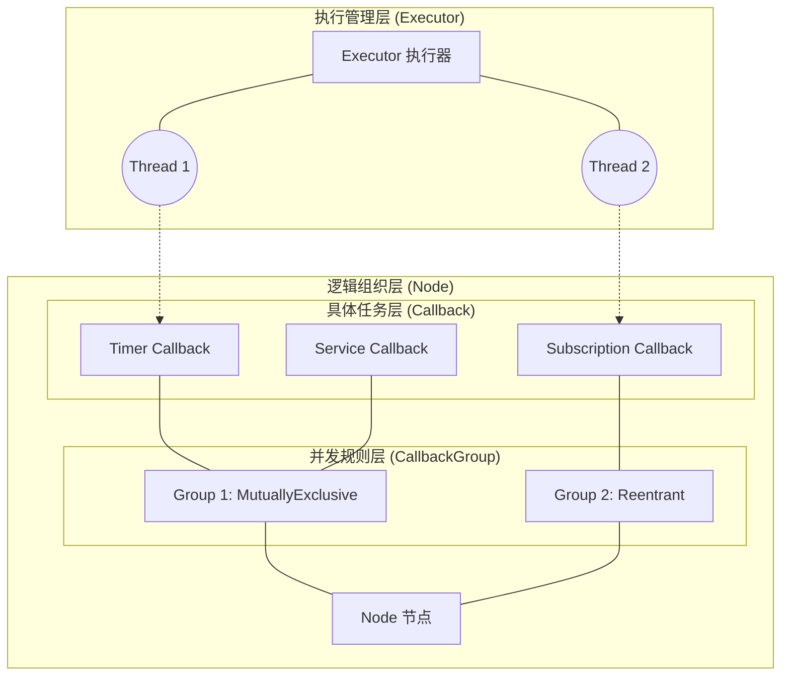

# 🏗️ ROS 2 执行架构详解：Executor, CallbackGroup, Callback

## 🌟 总体结构：层级关系

理解 ROS 2 的执行机制，最核心的是理解以下三个层级的关系：

### 核心定义
1.  **Callback (回调函数)**：最底层的执行单元。比如定时器触、收到消息、服务请求。
2.  **CallbackGroup (回调组)**：回调的**规则管理器**。它不负责执行，只负责**准入控制**（谁能跑，谁得等）。
3.  **Executor (执行器)**：底层的**资源提供者**。它拥有线程池，负责从队列里取任务并在线程上运行。

---

## 1. ROS 2 中的执行器类型

| 执行器名称 | 说明 | 线程模型 | 优缺点 |
| :--- | :--- | :--- | :--- |
| **SingleThreadedExecutor** | 最简单的执行器，默认使用。 | **单线程** | 简单安全，无竞态条件；但一个回调阻塞，全家阻塞。 |
| **MultiThreadedExecutor** | 并发执行器。 | **多线程池** | 支持真正的并行处理；需要开发者处理线程安全（锁）。 |
| **StaticSingleThreadedExecutor** | 静态单线程执行器。 | **单线程** | 优化了节点添加后的查找开销，适合节点结构极其固定的场景。 |
| **EventsExecutor** (Jazzy+) | 最新的事件驱动执行器。 | **单/多线程** | 大幅降低了空闲时的 CPU 占用（不再频繁轮询），性能更强。 |

---

## 2. 三者的链式工作流程

当一个事件（如消息到达）发生时，发生了什么？

1.  **事件产生**：RMW（中间件）检测到数据到达。
2.  **Executor 唤醒**：Executor 的等待机制（WaitSet 或 Event）被唤醒。
3.  **寻找回调**：Executor 找到该事件对应的 **Callback**。
4.  **规则检查**：Executor 询问该 Callback 所属的 **CallbackGroup**：*“现在能跑吗？”*
    -   如果是 **MutuallyExclusive** 且组内有人正在跑：**拒绝**，继续等待。
    -   如果是 **Reentrant** 或组内没人跑：**允许**。
5.  **分配线程**：Executor 从自己的线程池里调拨一个空闲线程。
6.  **执行**：回调函数在该线程上运行。

---

## 3. 深入理解：为什么需要 CallbackGroup？

**Executor** 像是一个雇佣兵公司（有一堆线程）。
**Callback** 像是一个个任务。

如果你直接把任务扔给雇佣兵，可能会出问题：
- 两个线程同时修改同一个变量（数据损坏）。
- 两个任务互相等待对方释放资源（死锁）。

**CallbackGroup** 就是**任务规则卡**：
- 它告诉 Executor：*"虽然你有 4 个线程，但这两个任务 (Group 1) 我要求必须排队执行，不能同时跑！"*
- 它也可能说：*"这两个任务 (Group 2) 随便跑，越多线程越好！"*

---

## 4. 最佳实践总结

### 🚀 避坑指南
-   **永远不要**在回调函数里写 `while(true)` 或长延时操作，除非你使用了 `MultiThreadedExecutor` 并且回调在独立的组中。
-   **默认使用 MutuallyExclusive**。只有当你发现：
    1.  发生了死锁（如 Action 通信）。
    2.  需要极其密集的并发处理且你确信代码线程安全。
    才切换到 `Reentrant`。

### 🏎️ 性能建议 (Jazzy 时代)
如果你在运行 ROS 2 Jazzy 或更新版本，尝试使用 **EventsExecutor**，它在低频任务较多时能显著节省机器的电量和 CPU 资源。

---

## 5. 总结

| 角色 | 负责什么 | 相当于 |
| :--- | :--- | :--- |
| **Callback** | **做什么** (Logic) | 厨师手中的**菜谱** |
| **CallbackGroup** | **怎么并发** (Policy) | 厨房的**排位规则** |
| **Executor** | **谁来跑** (Resource) | 厨房里的**厨师团队** |
