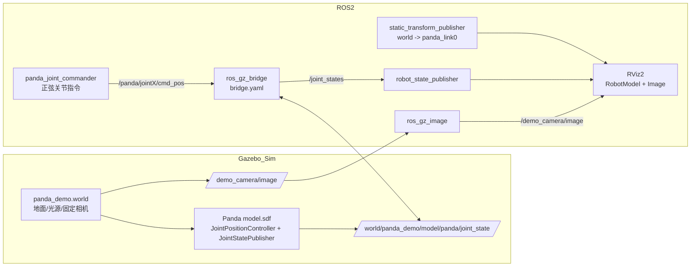

# ros2_learning_panda_gazebo_demo

Beginner-friendly Panda Gazebo Sim + RViz2 demo with a fixed camera (not on the arm). The Panda moves in Gazebo, and RViz2 follows via shared joint states.

## Features
- Gazebo Sim world + fixed camera
- Panda joint position controllers driven by a simple sinusoidal node
- `joint_states` bridged from Gazebo to ROS, RViz2 synced by `robot_state_publisher`
- RViz2 includes camera image display

## Dependencies
```bash
sudo apt update
sudo apt install -y \
  ros-jazzy-ros-gz-sim \
  ros-jazzy-ros-gz-bridge \
  ros-jazzy-ros-gz-image \
  ros-jazzy-moveit-resources-panda-description \
  ros-jazzy-rviz2
```

## Build
```bash
cd ~/Ros2Learning/ros2_ws
colcon build --packages-select ros2_learning_panda_gazebo_demo
source install/setup.bash
```

## Run
```bash
ros2 launch ros2_learning_panda_gazebo_demo panda_gazebo_rviz.launch.py
```

## Topics
- Joint command (ROS -> Gazebo): `/panda/joint1/cmd_pos` ... `/panda/joint7/cmd_pos`
- Joint state (Gazebo -> ROS): `/joint_states`
- Camera image (Gazebo -> ROS): `/demo_camera/image`

## Layout
```
ros2_learning_panda_gazebo_demo/
├── launch/
├── config/
├── models/
├── urdf/
├── worlds/
└── rviz/
```

## Notes
- The Panda URDF is based on `moveit_resources_panda_description`, with inertial blocks added for Gazebo Sim.
- Motion is a simple sinusoidal trajectory for learning and visualization.

## 架构图（Mermaid）


## 常见问题
1) RViz2 看不到机械臂
- 确认 RViz 的 Fixed Frame 为 `world`
- RobotModel 必须订阅 `/robot_description` 话题（本包已默认设置）
- 运行中可检查：`ros2 topic echo /joint_states --once`

2) `/joint_states` 没有数据
- 确认桥接节点已启动：`ros2 node list | grep ros_gz_bridge`
- 重新启动仿真：`ros2 launch ros2_learning_panda_gazebo_demo panda_gazebo_rviz.launch.py`

3) Gazebo 报 mimic 相关错误
- Panda 夹爪 mimic 约束在当前物理引擎下不支持，可忽略（不影响本演示）

4) Gazebo 提示 mesh 找不到
- 确认已安装 `ros-jazzy-moveit-resources-panda-description`
- 确认环境变量 `GZ_SIM_RESOURCE_PATH` 已被 launch 设置

5) Gazebo 里机械臂看起来很小
- 在 Gazebo 中选中 Panda，按 `F` 聚焦模型
- 鼠标滚轮缩放视角
