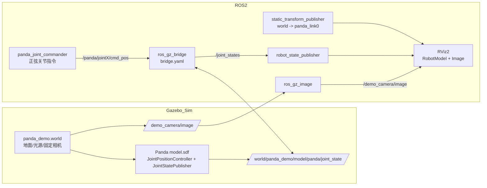

# ros2_learning_panda_gazebo_demo

> Franka Panda 机械臂 Gazebo Sim + RViz2 入门演示：`panda_joint_commander` 节点以正弦波驱动 7 个关节，通过 `ros_gz_bridge` 实现 ROS 2 与 Gazebo 的双向通信，并在 RViz2 中同步显示机械臂状态和固定相机图像。

Beginner-friendly Panda Gazebo Sim + RViz2 demo with a fixed camera (not on the arm). The Panda moves in Gazebo, and RViz2 follows via shared joint states.

## 功能描述

`panda_joint_commander` 节点（20 Hz 定时器）为 Panda 的 7 个关节分别计算正弦轨迹（各关节相位依次错开 0.8 rad，运动幅度为关节范围的 30%），并将 `std_msgs/msg/Float64` 指令发布到 `/panda/joint{1-7}/cmd_pos`。

数据流如下：
- **控制链**：`panda_joint_commander` -> `ros_gz_bridge` -> Gazebo JointPositionController
- **反馈链**：Gazebo JointStatePublisher -> `ros_gz_bridge` -> `/joint_states` -> `robot_state_publisher` -> RViz2 RobotModel
- **图像链**：Gazebo 固定相机 -> `ros_gz_image` -> `/demo_camera/image` -> RViz2 Image 面板
- **时间同步**：Gazebo `/clock` 经 `ros_gz_bridge` 桥接给所有 ROS 节点（`use_sim_time: true`）

所有组件通过 `panda_gazebo_rviz.launch.py` 一键启动。

---

## Features
- Gazebo Sim world + fixed camera
- Panda joint position controllers driven by a simple sinusoidal node
- `joint_states` bridged from Gazebo to ROS, RViz2 synced by `robot_state_publisher`
- RViz2 includes camera image display

## Dependencies
```bash
sudo apt update
sudo apt install -y \
  ros-jazzy-ros-gz-sim \
  ros-jazzy-ros-gz-bridge \
  ros-jazzy-ros-gz-image \
  ros-jazzy-moveit-resources-panda-description \
  ros-jazzy-rviz2
```

## Build
```bash
cd ~/Ros2Learning/ros2_ws
colcon build --packages-select ros2_learning_panda_gazebo_demo
source install/setup.bash
```

## Run
```bash
ros2 launch ros2_learning_panda_gazebo_demo panda_gazebo_rviz.launch.py
```

## 输入/输出

| 话题 | 类型 | 方向 | 说明 |
|------|------|------|------|
| `/panda/joint1/cmd_pos` ~ `/panda/joint7/cmd_pos` | `std_msgs/msg/Float64` | ROS -> Gazebo | 关节位置控制指令（节点发布，bridge 转发） |
| `/joint_states` | `sensor_msgs/msg/JointState` | Gazebo -> ROS | 关节实时状态（bridge 桥接自 Gazebo 内部话题） |
| `/demo_camera/image` | `sensor_msgs/msg/Image` | Gazebo -> ROS | 固定相机图像 |
| `/clock` | `rosgraph_msgs/msg/Clock` | Gazebo -> ROS | 仿真时间同步 |
| `/robot_description` | `std_msgs/msg/String` | ROS 内部 | URDF 字符串（`robot_state_publisher` 发布，RViz2 订阅）|
| `/tf` / `/tf_static` | `tf2_msgs/msg/TFMessage` | ROS 内部 | 坐标系变换树 |

本包不提供任何服务和动作接口。

## Topics
- Joint command (ROS -> Gazebo): `/panda/joint1/cmd_pos` ... `/panda/joint7/cmd_pos`
- Joint state (Gazebo -> ROS): `/joint_states`
- Camera image (Gazebo -> ROS): `/demo_camera/image`

## Layout
```
ros2_learning_panda_gazebo_demo/
├── launch/
├── config/
├── models/
├── urdf/
├── worlds/
└── rviz/
```

## Notes
- The Panda URDF is based on `moveit_resources_panda_description`, with inertial blocks added for Gazebo Sim.
- Motion is a simple sinusoidal trajectory for learning and visualization.

## 架构图（Mermaid）

```mermaid
flowchart LR
  subgraph Gazebo_Sim
    WORLD[panda_demo.world<br/>地面/光源/固定相机]
    MODEL[Panda model.sdf<br/>JointPositionController + JointStatePublisher]
    CAM[/demo_camera/image/]
    JS_GZ[/world/panda_demo/model/panda/joint_state/]
    WORLD --> MODEL
    WORLD --> CAM
    MODEL --> JS_GZ
  end

  subgraph ROS2
    CMD[panda_joint_commander<br/>正弦关节指令]
    BRIDGE[ros_gz_bridge<br/>bridge.yaml]
    IMG_BRIDGE[ros_gz_image]
    RSP[robot_state_publisher]
    RVIZ[RViz2<br/>RobotModel + Image]
    TFSTATIC[static_transform_publisher<br/>world -> panda_link0]
    CMD -->|/panda/jointX/cmd_pos| BRIDGE
    BRIDGE -->|/joint_states| RSP
    IMG_BRIDGE -->|/demo_camera/image| RVIZ
    RSP --> RVIZ
    TFSTATIC --> RVIZ
  end

  BRIDGE <--> JS_GZ
  CAM --> IMG_BRIDGE
```

## 验收测试

暂无，待补充。

（可手动验收：launch 启动后 Gazebo 中 Panda 应开始周期性摆动，RViz2 RobotModel 应同步运动，Image 面板应显示固定相机画面；`ros2 topic hz /joint_states` 应约 50 Hz。）

---

## 已知限制

- Panda 夹爪 mimic 约束在 Gazebo Sim (Harmonic) 物理引擎下不支持，会打印警告，但不影响演示。
- 使用 `moveit_resources_panda_description` 的 URDF 并手动添加了惯性块（inertial），与 MoveIt 官方配置不完全一致，不可直接用于 MoveIt 规划。
- 运动轨迹为开环正弦波，无任何闭环控制或碰撞检测，不适合真实机器人。
- 依赖 WSL2 下的 GPU 渲染支持（Gazebo Sim Harmonic）；若显卡驱动配置不当，Gazebo 可能无法启动或渲染异常。
- 固定相机位置硬编码在 world SDF 中，需修改 `worlds/` 下的文件才能调整视角。

---

## 常见问题
1) RViz2 看不到机械臂
- 确认 RViz 的 Fixed Frame 为 `world`
- RobotModel 必须订阅 `/robot_description` 话题（本包已默认设置）
- 运行中可检查：`ros2 topic echo /joint_states --once`

2) `/joint_states` 没有数据
- 确认桥接节点已启动：`ros2 node list | grep ros_gz_bridge`
- 重新启动仿真：`ros2 launch ros2_learning_panda_gazebo_demo panda_gazebo_rviz.launch.py`

3) Gazebo 报 mimic 相关错误
- Panda 夹爪 mimic 约束在当前物理引擎下不支持，可忽略（不影响本演示）

4) Gazebo 提示 mesh 找不到
- 确认已安装 `ros-jazzy-moveit-resources-panda-description`
- 确认环境变量 `GZ_SIM_RESOURCE_PATH` 已被 launch 设置

5) Gazebo 里机械臂看起来很小
- 在 Gazebo 中选中 Panda，按 `F` 聚焦模型
- 鼠标滚轮缩放视角
